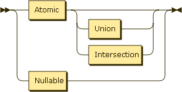
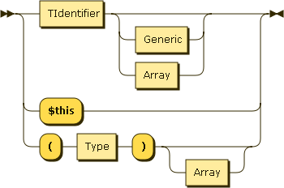
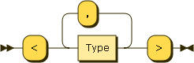
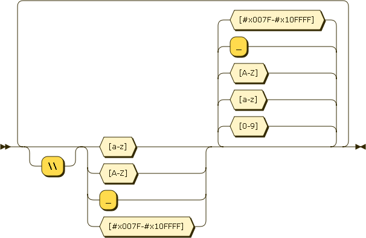

# PHPDoc Parser

PHPDoc parser with support for nullable, intersection and generic types.

## Grammar Diagram

### Type

### Union

### Intersection

### Nullable

### Atomic

### Generic

### Array

### TIdentifier

